```mermaid
graph LR
    A[💡 Your Company] -->|Needs| B[Talented Developer]
    B -->|Has| C[Full Stack Skills]
    B -->|Has| D[Cloud Expertise]
    B -->|Has| E[ML Knowledge]
    C --> F[🎯 Let's Connect!]
    D --> F
    E --> F
    style A fill:#ff6b6b
    style F fill:#4ecdc4
    style B fill:#95e1d3
```

<!-- Animated Header -->
<p align="center">
  
</p>

<p align="center">
  <a href="mailto:nivethanrajendran@gmail.com">
    
  </a>
  <a href="https://linkedin.com/in/nivethan-rajendran15">
    
  </a>
  
</p>

---


### 👨‍💻 About Me

🎓 **IT Undergraduate** | B.Sc. (Hons) Information Technology  
🌍 Based in **Sri Lanka** 🇱🇰  
💡 Passionate about **Distributed Systems & AI**  
🔥 Building **production-ready, scalable applications**  
🎯 Open for **Internships & Collaborations**

<br>

### 🎯 What I Do

```yaml
role: Full Stack Developer & Cloud Engineer
focus:
  - Microservices Architecture
  - Event-Driven Systems
  - Machine Learning Integration
  - Cloud-Native Development
currently_exploring:
  - Advanced Kafka Patterns
  - Kubernetes Orchestration
  - MLOps Pipelines
```

<br clear="right"/>

---

<h2 align="center">🛠️ Technology Stack</h2>

<div align="center">

### **Backend Development**


### **Message Brokers & Event Streaming**


### **Frontend Development**


### **AI & Machine Learning**


### **Cloud & DevOps**


### **Databases**


</div>

---

<h2 align="center">📈 GitHub Statistics</h2>

<p align="center">
  
  
</p>

<p align="center">
  
</p>

<p align="center">
  
</p>

---

<h2 align="center">🏆 Achievements</h2>

<p align="center">
  
</p>

---

<h2 align="center">💼 Open For Opportunities</h2>

<div align="center">



</div>

<p align="center">
  <b>🚀 Internships | 🤝 Remote Projects | 🌟 Open Source Contributions</b>
</p>

<p align="center">
  <a href="mailto:nivethanrajendran@gmail.com">
    
  </a>
  <a href="https://linkedin.com/in/nivethan-rajendran15">
    
  </a>
</p>

---

<div align="center">
  
### 💭 Quote of the Day
  


</div>

---

<p align="center">
  
</p>

<p align="center">
  <i>⭐️ From <a href="https://github.com/nivethan-nirosh">Nivethan Rajendran</a> - Let's build something amazing together!</i>
</p>
